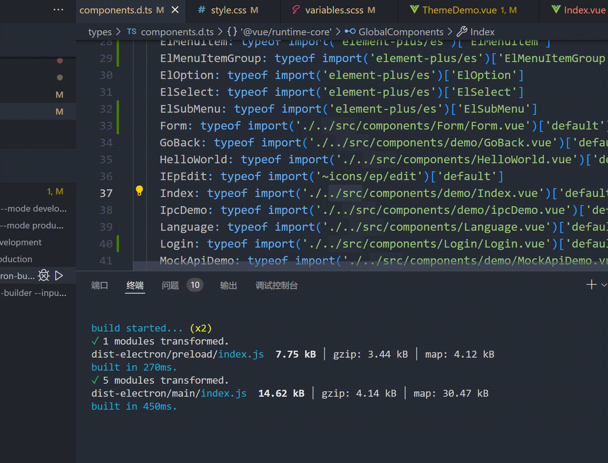

# 说明
+ 本项目是基于`electron`、`vue3`、`vite`、`Element Plus`构建的项目。
+ 由于没找到带登录及菜单边栏的electron+vue3+element-plus模板，故自己搭建。
+ 本项目基于[electron-vue3-template](https://gitee.com/longzipeng/electron-vue3-template)搭建，页面演示中包含了该项目内的组件。在其基础上，增加了登录页面、左侧菜单栏等页面，登录跳转、退出登录等功能。


# 技术栈
- electron
- vite
- vue3
- typescript
- element-plus
- axios
- pinia
- Vue Router
- vue-i18n
- sass
- mockjs

# 运行
1. 该项目开发使用的node环境为 16.14.2
   
2. 安装依赖

```cmd
npm install
```

3. 运行项目
```cmd
npm run dev
```

4. 打包项目
   - 原模板打包命令“vue-tsc --noEmit && vite build && electron-builder”在打包时候有报错，修改后可打包，[具体见这篇文章](https://blog.csdn.net/xiaoshiqi17/article/details/141111324?spm=1001.2014.3001.5501)。
```cmd
npm run build
```

5. 打包后运行
   - 打包后的文件在`release`文件夹下，有两种打开方式，安装或者免安装（`win-unpacked`文件夹内）。
   - 运行exe文件时报错：electron-update 插件报错“Uncaught Exception: Error: Cannot find module 'builder-util-runtime'”。[可以参考这篇文章](https://stackoverflow.com/questions/75563355/electron-app-with-electron-updater-built-with-npm-run-make-does-not-work)。这个项目因为用不到，所以直接注释了该模块，注释后可成功运行。


# 演示




# 工程目录结构

```diff
+ ├─┬ electron
+ │ ├─┬ main
+ │ │ └── index.ts    Electron主进程入口
+ │ └─┬ preload
+ │   └── index.ts    预加载ts脚本
  ├─┬ src
  │ ├── main.ts       Electron-渲染进程入口[即vue相关页面构建代码]
  | ├── assets        静态资源目录
  | ├── components    封装的vue组件目录
  | ├── directive     自定义指令
  | ├── hooks         组合式函数封装
  | ├── locales       国际化，多语言支持
  | ├── store         全局状态管理
  | └── utils         ts工具类
  ├── index.html
  ├── package.json
  └── vite.config.ts
```
